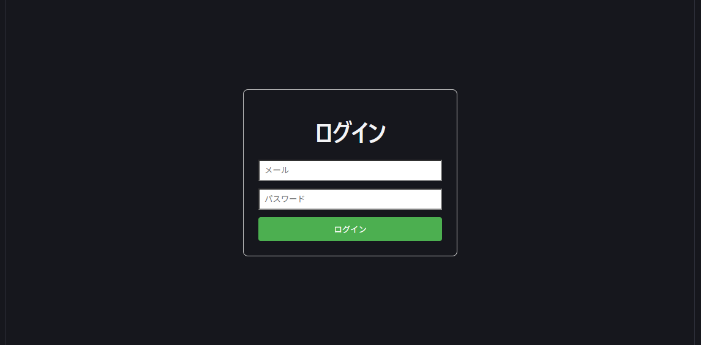

# My App

## 📝 概要
React + Go + PostgreSQL + Dockerで構築した個人用Webアプリです。

## 📸 画面イメージ




## 🚀 使用技術

### Frontend
- React
- Vite

### Backend
- Go (Gin)
- GORM

### Database
- PostgreSQL

### Infrastructure
- Docker / Docker Compose

## 🔗 API
- POST /login（認証トークン取得）
- GET /me（ログインユーザー情報取得）
- GET /users（ユーザー一覧 ※認証必須）

詳細は[API仕様](./docs/api.md)を参照


### 技術選定理由
- React: モダンなフロントエンド開発を学ぶため
- Go: 高速でシンプルなバックエンド開発を体験するため
- Docker: 環境構築を統一し、再現性を高めるため


## 🏗 アーキテクチャ

- Controller: リクエスト受付
- Service: ビジネスロジック
- Repository: DB操作


## 🔐 認証

- JWTを使用
- Authorizationヘッダーで認証


## 📂 ディレクトリ構成
```
.
├── backend
│  ├── controller
│  ├── db
│  ├── dto
│  ├── middleware
│  ├── model
│  ├── repository
│  ├── router
│  ├── service
│  └── utils
├── docs
└── frontend
    ├── public
    └── src
        └── assets
```


## 🚧 今後の予定
- 投稿機能の追加
- UI/UXの改善
- 認証周りの強化（リフレッシュトークンなど）

---

## ⚙️ 環境構築

### 1. クローン
```bash
git clone git@github-personal:yourname/my-app.git
cd my-app
```

### 2. 環境変数設定
```bash
cp backend/.env.example backend/.env
```

### 3.起動
```bash
docker compose up --build
```

## 🌐 アクセス
- Frontend: http://localhost:5173
- Backend: http://localhost:8080

## 📌 機能
- ユーザー登録
- ログイン（JWT認証）
- ユーザー一覧取得（認証必須）

## 🧠 学んだこと
- レイヤードアーキテクチャでのAPI設計
- JWT認証の実装とミドルウェアによる認可制御
- Dockerを用いたフルスタック環境構築
- ReactとAPIの連携方法


## 📄 ライセンス
MIT