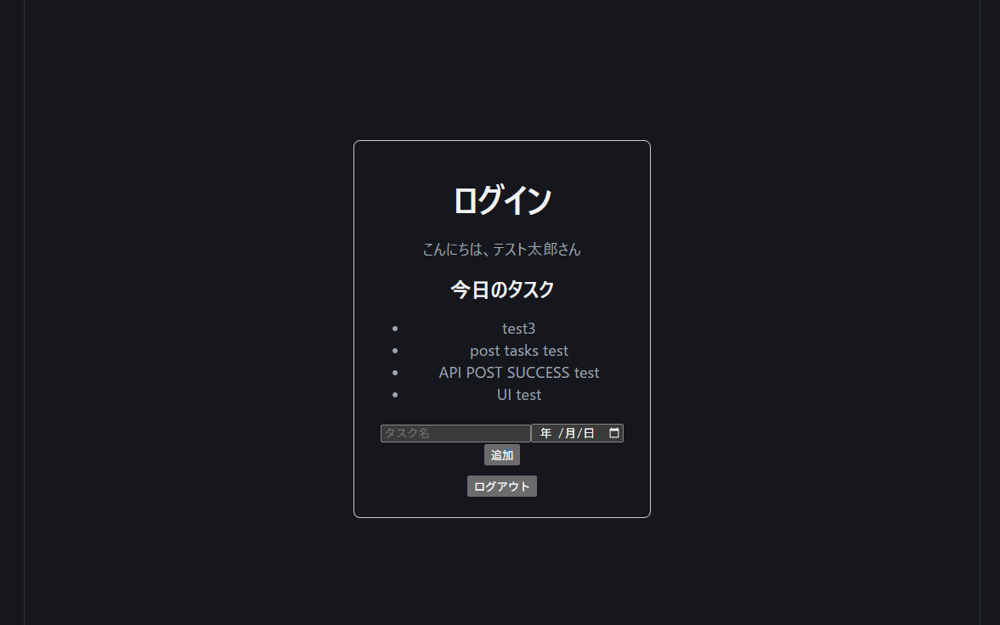

# 📝 My Task App
「今日やること」に集中するためのシンプルなタスク管理アプリ

## 🚀 デモ



## 💡 コンセプト
一般的なタスク管理アプリは「一覧で管理する」ことに重きを置きがちですが、  
本アプリは「実際に行動できる状態にする」ことを重視しています。

- 今日やるタスクにフォーカス
- シンプルなUI
- 最低限の操作で実行できる設計

## 🧩 主な機能
- ユーザー登録
- ログイン（JWT認証）
- タスク作成
- タスク一覧取得
- 今日のタスク表示（dueDateベース）

## 🛠 技術スタック

### Frontend
- React
- TypeScript
- Vite

### Backend
- Go
- Gin
- GORM

### Database
- PostgreSQL

### Infrastructure
- Docker / Docker Compose

## 🏗 アーキテクチャ
レイヤードアーキテクチャを採用
- Controller: リクエスト受付
- Service: ビジネスロジック
- Repository: DB操作

## 🔗 API設計（重要ポイント）
本アプリでは、APIレスポンスを以下の形式に統一しています。  
詳細は[API仕様](./docs/api.md)を参照

### 成功時
```json
{
  "data": {...},
  "error": null
}
```

### エラー時
```json
{
  "data": null,
  "error": {
    "code": "ERROR_CODE",
    "message": "message",
    "details": [...]
  }
}
```

### 設計意図
- フロントエンドは `error.code` を用いて分岐
- `message` はユーザー表示用（変更可能）
- `details` によりフィールド単位のエラーを表現

👉 表示と制御を分離することで、変更に強い設計にしています

## 認証
- JWTベース認証
- Authorizationヘッダーで管理
- 認証エラーは詳細を分けず統一（セキュリティ対策）


## ⚙️ セットアップ

### 1. クローン
```bash
git clone git@github-personal:yourname/my-app.git
cd my-app
```

### 2. 環境変数設定
```bash
cp backend/.env.example backend/.env
```

### 3.起動
```bash
docker compose up --build -d
```

### 4.アクセス
- Frontend: http://localhost:5173
- Backend: http://localhost:8080


## 📂 ディレクトリ構成

主要ディレクトリ:

- backend: APIサーバ
- frontend: UI
- docs: 仕様・画像

```
.
├── backend
│  ├── controller
│  ├── db
│  ├── dto
│  ├── middleware
│  ├── model
│  ├── pkg
│  ├── repository
│  ├── router
│  ├── service
│  └── utils
├── docs
└── frontend
    ├── public
    └── src
        ├── assets
        ├── components
        ├── lib
        └── types
```


## 🚧 今後の予定
- タスク完了機能（チェック）
- タスク更新・削除
- 今日以外のタスク表示
- UI/UXの改善
- 認証強化（リフレッシュトークン）


## 🧠 工夫したポイント
- APIレスポンスを完全に統一
- エラーを code ベースで管理
- フロントは code のみを参照して分岐
- details によりバリデーションを柔軟に表現
👉 実務を意識した設計にしています


## ⚠️ 今後の改善余地
- バリデーションロジックのService層への集約
- APIクライアントの共通化
- エラーハンドリングのさらなる整理
- テストコードの追加


## 📄 ライセンス
MIT